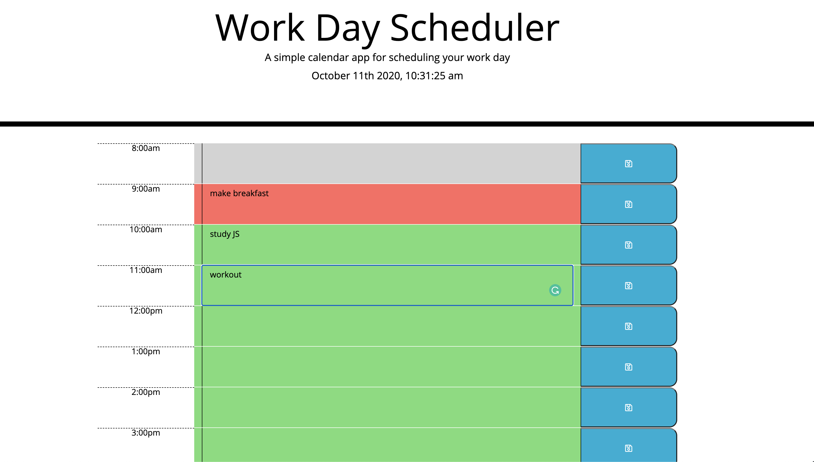

# Day Planner

---

## About

---

A simple yet useful day planner to remember daily todos.
Buitl with HTML basic CSS and JavaScript we have a final application that will save an dremember your data.

---

## Project links

---

## Built with

- jQuery

> \$(document).ready - will load only when DOM is ready

> \$("<>") method creates a new ellement

> .attr() method will sets attributes and values to the selected elements

> .append() method will insert content at the end of selected items

> .getItem() method returns of a specified local storage item

- moment.js \* Used for manipulating,parsing and displaying current date&time formats

  `moment().format('MMMM Do YYYY, h:mm:ss a');`

- JSON

  `JSON.parse()`
  `JSON.stringify()`

---

## Sources

- Triology schools starter code (provied)
- [Moment.js](https://momentjs.com/)
- [jQuery/learningcenter](https://learn.jquery.com/)
- HeadFirstJavaScript(reference book)
- [JSON W3Schools](https://www.w3schools.com/js/js_json_intro.asp)
- [StackOverflow](https://stackoverflow.com/)
- [W3Schools](https://www.w3schools.com/)
- [Developer Mozilla](https://developer.mozilla.org/en-US/docs/Web/JavaScript)

---

Valerian Nimirenco
[Current repository](https://github.com/valiant87/day-planner)
valnimirenco@gmail.com

---

### License : none
